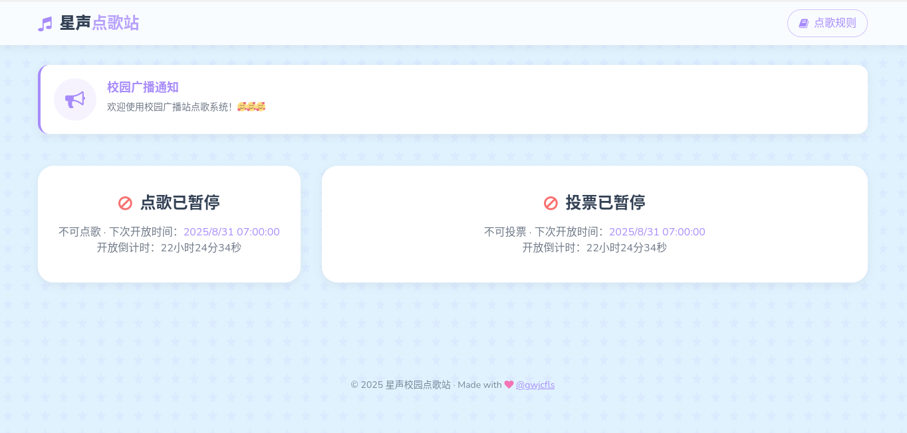
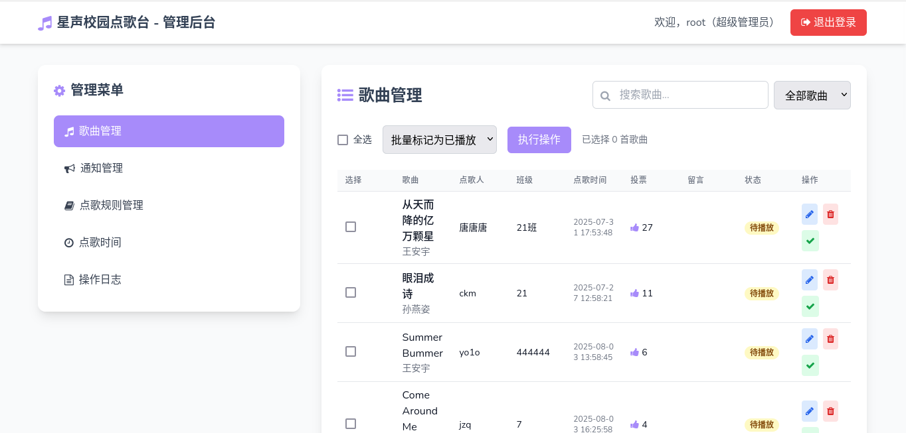
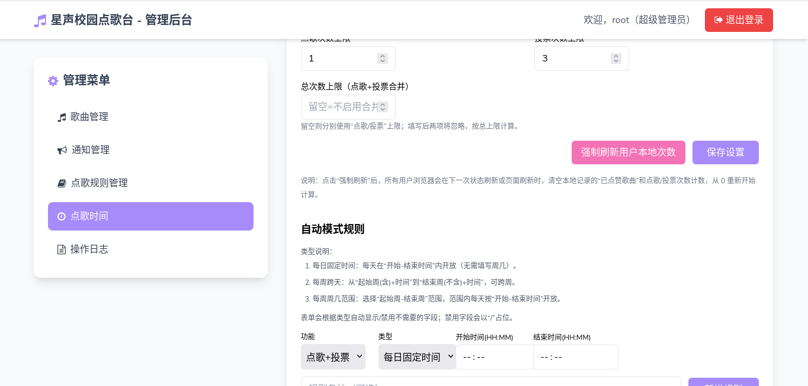

<p align="center">
  
</p>
  <h1 align="center">
  星声校园点歌台
</h1>
   <h3 align="center">
  Campus Melody Link
</h3>
<p align="center">
 全新响应时布局的校园点歌台——“星声” 既指歌声如星光般点亮校园，也暗含 “心声”，借歌曲传递情感的心意
 “Melody Link” 寓意用旋律连接校园里的人和事
</p>

<div align="center">

[](https://github.com/Class-Widgets/Class-Widgets)
[](https://github.com/Class-Widgets/Class-Widgets/releases/latest)
[](https://github.com/Class-Widgets/Class-Widgets?tab=GPL-3.0-1-ov-file)


</div>

一套可直接部署的在线点歌与投票系统，包含前台点歌/投票、公告与规则展示、后台歌曲与公告/时间规则/日志管理、敏感词审核、时间开放策略（手动/自动）与本地次数限制等完整能力。后端 PHP + MySQL，前端 Tailwind CSS + Font Awesome，敏感词检测基于前缀树（Trie）高效匹配。

提示：本文所有路径均相对于项目根目录（例如 /var/www/html）。

## 功能总览

- 前台
   - 在线点歌（含点歌人、班级、留言）与待播清单/播放历史展示
   - 歌曲投票（点赞/取消点赞，含本地次数与已投歌曲记忆）
   - 公告与点歌规则展示（模态框）
   - 搜索歌曲（对接第三方 API 展示，仅前端检索用于辅助填写）
   - 时间窗口与次数限制：根据“手动/自动时间策略”控制是否开放点歌/投票，并在客户端执行次数配额（可合并计数）
- 后台（admin.php）
   - 登录/登出（支持多角色，示例为 admin/super_admin）
   - 歌曲管理：查找/筛选/编辑/删除，标记已播/未播，批量操作（删除/标记播放状态/重置票数）
   - 公告管理、规则管理（富文本/纯文本）
   - 时间管理：
      - 模式：手动（开关点歌/投票）/自动（按规则计算）
      - 本地配额：request_limit、vote_limit，或启用 combined_limit 为总次数
      - 规则维护：支持三类时间规则，启用/停用/编辑/删除
      - 一键“强制刷新用户本地次数”（reset_seq 序列号自增）
   - 操作日志：记录关键行为（含用户/角色/IP/目标/详情）
- 运营支持
   - 敏感词检测：提交点歌时对留言执行 Trie 匹配拦截
   - 完整的 API 与测试脚本：fuzz + 极端 case 校验时间逻辑正确性

## 项目截图

项目前台（开放点歌投票状态）


项目前台（关闭点歌投票状态）


项目后台（歌曲管理）


项目后台（时间管理）


[查看更多截图 →](img/screenshot/README.md)


## 技术栈与关键文件

- PHP 7.2+，PDO MySQL
- 前端：Tailwind CSS（本地 js 版）、Font Awesome
- 主要文件
   - 前台：`index.php`
   - 后台：`admin.php`、`admin_login.php`、`admin_logout.php`、`admin_fragment.php`
   - 点歌提交：`submit_request.php`
   - 歌曲接口：`get_song.php`、`update_song.php`、`delete_song.php`、`mark_played.php`、`batch_operation.php`
   - 公告/规则：`update_announcement.php`、`update_rule.php`
   - 时间策略：`time_config.php`（带路由/API）、`time_lib.php`（纯函数库）
   - 敏感词：`badwords.php`（词库）、`build.php`（构建器）、`trie_cache.php`（构建产物）
   - 数据库与连接：`database_setup.sql`、`db_connect.php`
   - 测试：`tests/`（见“测试与验证”）

## 安装与部署

#### 快速开始：一键安装（推荐）

- 将项目上传/放置到站点目录后，直接访问浏览器地址：/install.php
- 填写数据库主机/库名/用户/密码，可选：
   - 若数据库不存在则创建
   - 导入初始化结构与示例数据（database_setup.sql）
   - 构建敏感词前缀树（build.php）
   - 创建/更新初始管理员（用户名、密码、角色）
- 点击“一键部署”，成功后请立刻删除 install.php 以防被滥用；系统会生成 install.lock 以避免重复安装（如需重装，删除该文件）。
- 自动执行的动作包括：
   - 导入/初始化数据库结构（含 time_settings/time_rules 等）
   - 确保 admins 表存在，并按需创建/更新管理员
   - 写入 db_connect.php（若已存在会自动备份为 .bak-时间戳）
   - 触发 time_config.php 的 schema 保障逻辑（确保 reset_seq/combined_limit 等字段就绪）
   - 构建 trie_cache.php（若勾选）

[点击查看使用方法](#使用方法快速上手)

安全提示：
- 生产环境务必使用 HTTPS；db_connect.php 建议权限 600/640。
- 安装完成后删除 install.php；如需再次安装请先删除 install.lock。

如不使用安装向导，也可以按下述“手动安装”步骤执行。

#### 手动安装

1) 环境要求
- PHP 7.2+（推荐 7.4/8.x），启用 PDO MySQL
- MySQL 5.7+/8.0+
- Web 服务器：Nginx/Apache（推荐 HTTPS）
- 时区：代码默认 `Asia/Shanghai`（见 `db_connect.php`）

2) 初始化数据库
- 导入 `database_setup.sql`
- 注意：`database_setup.sql` 未包含管理员表，请创建 `admins` 表（见下）并插入至少一位管理员

示例 `admins` 表（推荐使用 PASSWORD_DEFAULT 哈希存储）：

```sql
CREATE TABLE IF NOT EXISTS admins (
   id INT AUTO_INCREMENT PRIMARY KEY,
   username VARCHAR(64) UNIQUE NOT NULL,
   password VARCHAR(255) NOT NULL,
   role ENUM('admin','super_admin') NOT NULL DEFAULT 'admin',
   created_at TIMESTAMP DEFAULT CURRENT_TIMESTAMP
);
```

插入管理员密码哈希（建议用 PHP CLI 生成）：

```bash
php -r "echo password_hash('你的强密码', PASSWORD_DEFAULT), PHP_EOL;"
```

```sql
INSERT INTO admins (username, password, role)
VALUES ('admin', '上一步生成的哈希', 'super_admin');
```

3) 配置数据库连接
- 编辑 `db_connect.php` 的 `$host/$dbname/$username/$password`

4) 生成敏感词前缀树
- 确认/编辑 `badwords.php`（返回一个敏感词数组）
- 执行 `build.php` 生成 `trie_cache.php`

5) 配置 HTTPS（强烈推荐）
- 代码已启用安全型 Session：`session.cookie_secure=On`、`httponly=On`、`samesite=Strict`
- 若开发环境为纯 HTTP，可临时调整为 Off 或通过 HTTPS 访问，否则登录态可能无法保持

6) 访问
- 前台：`index.php`
- 后台：`admin.php`（点击“广播站”文字 5 次触发首页内置登录弹窗，或直接访问 admin.php）

## 使用方法（快速上手）

### 普通用户 — 点歌与投票（5 步）
1. 打开网站首页：访问 `index.php`。
2. 搜索并选择歌曲：在“歌曲名称”输入框输入关键词，点击放大镜按钮打开“搜索歌曲”弹窗，选择合适结果（前端会把 `song` 和 `singer` 填入表单）。
3. 填写信息并提交：填写你的姓名、班级与留言，点击“提交点歌”。若当前不在开放时段会收到提示，或次数已满会被阻止。
4. 投票：在待播清单中点击心形按钮为歌曲投票；已投过可再次取消（前端会更新本地 votedSongs）。
5. 查看播放历史：播放后歌曲会出现在“播放历史”列表，管理员也会标记已播放状态。

### 管理员 — 部署与常用操作（快速指南）
1. 创建管理员账户：在数据库中创建 `admins` 表并插入管理员记录（使用 PHP CLI 生成密码哈希）：

```bash
php -r "echo password_hash('你的强密码', PASSWORD_DEFAULT), PHP_EOL;"
```

2. 登录后台：连续点击五次点歌站文本，使用管理员账号登录。
3. 常用管理操作：
   - 歌曲管理：编辑/删除/标记已播/批量操作。
   - 公告与规则：在后台更新公告与点歌规则（立即生效，前台可见）。
   - 时间与配额：在“时间管理”中切换手动/自动模式、调整 request_limit/vote_limit 或启用 combined_limit。
4. 强制刷新用户次数：后台执行“强制刷新”，会使 `reset_seq` 自增，前端检测到后会清空本地计数并提示用户。
5. 敏感词管理：编辑 `badwords.php` 后运行 `php build.php` 生成/更新 `trie_cache.php`，以便提交点歌时生效。

常用命令示例：

```bash
# 生成敏感词 trie
php build.php

# 检查当前开窗/限额状态
curl "http://your.site/time_config.php?action=status"
```

说明：后台所有关键操作会写入 `operation_logs`，便于审计与排查问题。

## 以下是技术文档
### 数据库模型说明

初始化脚本 `database_setup.sql` 含以下核心表：

- song_requests：点歌记录（含留言、票数、是否已播、时间）
- announcements：公告
- rules：点歌规则文案（前台展示）
- operation_logs：操作日志（记录动作、用户、角色、IP、对象与详情）
- time_settings：时间/配额设置（最新 id 最大的记录生效）
- time_rules：自动模式下的时间规则列表

time_settings 字段要点：
- mode：'manual' | 'auto'
- manual_request_enabled / manual_vote_enabled：手动模式下开关
- request_limit / vote_limit：分别计数的每日上限（前端本地计数）
- combined_limit：总次数上限（为 NULL 表示未启用；启用时前端改为合并计数）
- reset_seq：整数序列号（由后端“强制刷新”按钮自增，前端据此清空本地次数与“已点赞”列表）

time_rules 字段要点：
- feature：'request' | 'vote' | 'both'（规则命中功能）
- type：1/2/3（见下文“自动时间规则语义”）
- start_weekday/end_weekday：周几（1=周一, ..., 7=周日），部分类型可为 NULL
- start_time/end_time：HH:MM:SS（部分类型可为 NULL）
- active：是否启用

注意：`time_config.php` 启动时会自动执行 schema 兜底迁移（添加/修正 combined_limit、reset_seq、id 自增等），确保线上升级安全。

### 自动时间规则语义（核心）

时间规则计算由 `time_config.php` 暴露的 `compute_status()` 驱动，纯函数实现见 `time_lib.php`。三类规则均支持“跨天/跨周”、重叠聚合：

- type=1 每日固定时间段
   - 仅使用 start_time/end_time（忽略 weekday），支持跨午夜：若 end <= start 视为次日结束
   - 例：09:00:00 → 21:00:00；23:00:00 → 00:30:00（跨日）
- type=2 每周跨天区间
   - 使用 start_weekday+start_time → end_weekday+end_time，可跨周（end 索引 <= start 索引 视为跨周）
   - 例：周五 18:00:00 → 周一 08:00:00（周末全开）
- type=3 每周“周几范围” + 当日固定起止
   - 指定一段周几范围（可 wrap，例如 6..2），在这些天里每日使用相同的 start_time/end_time，支持跨午夜

聚合策略：
- 多条规则命中时，open=true 若任一规则当前命中；next_close 取“所有命中规则的最晚结束”；closed 时 next_open 取“所有未命中规则的最近开始”
- feature 过滤：按 request/vote/both 聚合

返回对象（`GET time_config.php?action=status`）：

```json
{
   "success": true,
   "data": {
      "now": "2025-01-01T12:34:56+08:00",
      "mode": "manual|auto",
      "reset_seq": 3,
      "request": { "open": true, "next_open": null, "next_close": "..." },
      "vote":    { "open": false, "next_open": "...", "next_close": null },
      "limits": { "request": 1, "vote": 3, "total": 4 }
   }
}
```

### 前端“本地次数限制”与 reset_seq

前端在 `index.php` 中维护本地计数（localStorage）：

- 分别计数模式（combined_limit 未启用）
   - requestCount（点歌已用次数）、voteCount（投票已用次数）
   - 每类剩余 = limit - 已用
- 合并计数模式（combined_limit 启用）
   - actionCount（总已用次数），剩余 = total - 已用
- 已点赞歌曲列表：votedSongs（数组，支持取消点赞）
- 开窗识别与跨会话重置：
   - lastRequestOpen/lastVoteOpen：上一轮 open 布尔
   - requestToken/voteToken：'open:下一次关闭时间' 或 'closed:下一次开启时间'，用于识别“关闭→开启”的轮转
   - 当检测到“关闭→开启”：清空对应计数；在合并计数模式会清空所有计数与 votedSongs
- reset_seq（管理员“强制刷新”）
   - 后端将 reset_seq +1；前端比较 lastResetSeq 与服务端值，若变大则清空所有计数与 votedSongs，并提示“次数已刷新（管理员触发）”

注意：页面默认每 30 秒刷新一次状态；另外在点歌/投票等交互后也会刷新 UI。

### 后台使用与权限

- 角色
   - super_admin：除通用操作外，还可编辑歌曲内容与删除歌曲
   - admin：常规管理
- 主要板块
   - 歌曲管理：检索/筛选（全部/待播/已播），编辑/删除/标记播放状态，批量操作（删除/标记播放/重置票数）
   - 公告与规则：保存富文本/纯文本内容（首页展示）
   - 时间管理：
      - 手动模式：manual_request_enabled / manual_vote_enabled（开关）
      - 自动模式：按规则计算，维护规则（新增/编辑/删除/启停）
      - 配额：request_limit / vote_limit 或启用 combined_limit 为总次数
      - 强制刷新：一键 bump reset_seq
   - 操作日志：可展开查看 details（JSON）

所有后台关键动作均调用 `log_operation()` 写入 `operation_logs`（见 `db_connect.php`）。

### 敏感词检测

- 词库：`badwords.php`（返回字符串数组）
- 生成：运行 `build.php` 生成 `trie_cache.php`（纯 PHP 数组，线上直接 require 使用）
- 检测点：`submit_request.php` 在插入数据库前对留言 `message` 执行 Trie 扫描，命中则返回错误并拒绝提交
- 说明：Trie 为“多字节友好”，逐字符（UTF-8）前缀匹配，匹配到 `end` 即判定包含敏感词

### 服务端 API（主要）

时间/限额 API：`time_config.php`

- GET `?action=status`
   - 返回：当前模式、request/vote 开放与下一次开/关、limits（含 total 可选）、reset_seq
- GET `?action=get_settings`（需管理员登录）
- GET `?action=list_rules`（需管理员登录）
- POST `action=update_settings`（需管理员登录）
   - 参数：mode, manual_request_enabled, manual_vote_enabled, request_limit, vote_limit, combined_limit（空串视为未启用）
- POST `action=force_reset`（需管理员登录）
   - 效果：复制当前设置并让 reset_seq 自增 1，触发前端清空本地计数
- POST `action=add_rule|update_rule|delete_rule|toggle_rule`（需管理员登录）
   - 统一校验：type=1 需提供 start_time/end_time；type=2/3 需提供周几与时间

点歌/歌曲管理接口：
- POST `submit_request.php`：提交点歌（含敏感词校验、失败返回 JSON 提示）
- GET `get_song.php`：查询歌曲（支持条件）
- POST `update_song.php`、`delete_song.php`、`mark_played.php`、`batch_operation.php`

投票（前台）：
- GET `index.php?vote={id}&action=add|cancel`（后端含时间窗口硬校验）

公告/规则：
- POST `update_announcement.php`、`update_rule.php`

所有后台操作均返回 JSON：`{ success: boolean, message?: string, ... }`

### 搜索歌曲 API 返回数据要求

前台首页通过浏览器直接请求第三方歌曲搜索接口（见 `index.php`），并将返回结果展示在“搜索歌曲”弹窗中。因此，该接口需满足以下返回格式与行为约定：

- 请求方式：GET（示例：`/music/search?word=关键词`）。
- CORS：必须允许浏览器跨域访问（设置 `Access-Control-Allow-Origin: *` 或你的站点域名）。
- Content-Type：`application/json; charset=utf-8`。

顶层 JSON 结构（必需）：

- code：number。成功必须为 200；非 200 视为失败并显示“未找到”占位。
- data：array。结果数组；缺省/空数组将显示“未找到”。

单个结果对象字段：

- song：string，必填。歌曲名称，用于填写“歌曲名称”。
- singer：string，必填。歌手名称，用于填写“歌手”。
- cover：string，可选。封面图片完整 URL；需以 `http` 或 `https` 开头，若无或非法将回退到占位图。

前端使用与容错说明：

- 仅当 `code === 200` 时，才渲染 `data`；否则视为无结果。
- `data` 非数组或为空数组时，展示“没有找到”提示。
- 对于每个结果，`song`/`singer` 会被转成字符串并写入显示与隐藏字段，`cover` 非 http(s) URL 将被忽略并使用内置占位图。

示例响应（成功）：

```json
{
   "code": 200,
   "data": [
      {
         "song": "夜空中最亮的星",
         "singer": "逃跑计划",
         "cover": "https://example.com/covers/brightest-star.jpg"
      },
      {
         "song": "晴天",
         "singer": "周杰伦",
         "cover": "https://example.com/covers/qingtian.png"
      }
   ]
}
```

示例响应（失败或无结果）：

```json
{ "code": 404, "data": [] }
```

注意：前端不会使用音频播放 URL，仅用于辅助填写“歌曲名称/歌手”。如需扩展更多字段（如专辑名、时长），可在保持上述字段的前提下追加自定义字段。

### 安全加固

- Session：
   - `cookie_secure=On`（需 HTTPS）、`httponly=On`、`samesite=Strict`、`gc_maxlifetime=3600`、每次请求刷新 Session ID
   - 管理员登录：失败次数基于 IP 的滑动窗口锁定（`admin_login.php`）
- 数据层：
   - PDO 预处理防 SQL 注入
   - 统一操作日志留痕
- XSS：
   - 输出时 `htmlspecialchars` 与前端 `escapeHtml` 辅助
   - 模态框/Toast 文案注意来源可信

开发环境提示：若未启用 HTTPS，`cookie_secure=On` 可能导致登录态不生效。可在本地开发期临时关闭，线上务必开启。

### 测试与验证

目录：`tests/`

- `fuzz_time_config.php`：
   - 随机生成 `time_settings` 与 `time_rules`（auto 模式），反复调用 `compute_status()` 与纯函数 `eval_rule_window()` 做一致性断言
   - 同时随机触发一次 `reset_seq` 自增，并断言返回值正确
   - 失败样例写入 `tests/failures/`
- `hack_time_cases.php`：
   - 构造极端边界 case（24h 全开、跨午夜 1 秒、跨周 wrap、重叠规则取最晚 next_close 等）逐一断言

工作区已配置 VS Code 任务（运行于项目根目录）：

- “PHP tests: fuzz + hack”
   - 等价于：`php tests/fuzz_time_config.php 100 && php tests/hack_time_cases.php`

你也可以单独运行：

```bash
php tests/fuzz_time_config.php 500
php tests/hack_time_cases.php
```

## 常见问题（FAQ）

1. 登录不生效/跳回首页？
    - 开发环境未启用 HTTPS，但代码强制 `session.cookie_secure=On`，请改用 HTTPS 或临时关闭该选项

2. 管理员表不存在/无法登录？
    - `database_setup.sql` 不含 `admins` 表，请按本文“安装与部署”创建并插入一条管理员记录（密码用 `password_hash`）

3. 敏感词未生效？
    - 是否已运行 `build.php` 生成 `trie_cache.php`，且提交时留言 `message` 非空

4. 合并次数与分别计数怎么选？
    - 设置 `combined_limit` 为任意非空整数即启用合并计数；置空/NULL 则关闭并回到“分别计数”

5. 规则不生效/时间显示异常？
    - 检查服务器时区（`date.timezone`）、`date_default_timezone_set` 与数据库时间；确认 `type` 与字段是否满足必填要求

6. 使用 install.php 导入 SQL 时中文乱码或报错？
      - 请确保数据库和连接均为 utf8mb4。安装向导已在连接、库、表和会话层面强制使用 utf8mb4，并在导入后尝试将核心表统一转换为 `utf8mb4_unicode_ci`。
      - 若仍遇到问题，可手动执行：
         - 将数据库默认字符集改为 utf8mb4：`ALTER DATABASE <db> CHARACTER SET utf8mb4 COLLATE utf8mb4_unicode_ci;`
         - 针对已有表执行：`ALTER TABLE <table> CONVERT TO CHARACTER SET utf8mb4 COLLATE utf8mb4_unicode_ci;`
         - 在客户端连接后执行：`SET NAMES 'utf8mb4'; SET CHARACTER SET utf8mb4; SET collation_connection='utf8mb4_unicode_ci';`
      - 先检查文件夹写入权限。若 install.php 无法写入 `db_connect.php`，页面会给出可复制的文件内容，按提示手动创建后重试。

## 生产部署建议

- 使用 Nginx + PHP-FPM（或 Apache mod_php/FPM），全站 HTTPS
- 正确的时区与时钟同步（NTP）
- 定期备份数据库（含 song_requests/operation_logs/time_* 等）
- 敏感词词库与 `trie_cache.php` 作为代码资源随版本发布

## TODO-List

- [ ] 增加分页与导出 CSV（songs/logs）
- [ ] 添加后台管理员账号管理，可在后台新增管理员账号
- [ ] 优化代码缩进，格式化代码
- [ ] 优化后台手机端UI

## 协议

此项目 (星声校园点歌台) 基于 GPL-3.0 许可证授权发布，详情请参阅 [LICENSE](./LICENSE) 文件。

Copyright © 2025 gwjcfls.

## 致谢

感谢dyr同学的资金支持，感谢广大同学对本项目提出的改进建议，没有你们就没有这个项目的完善。

感谢各大AI（按使用量排序）：Chatgpt-5、Chatgpt-4 mini、Chatgpt-4、deepseek v3、Gemini 2.5 pro、Claude Sonnet 4、Grok Code Fast 1

感谢[落月api](https://doc.vkeys.cn/api-doc/)提供的歌曲搜索接口


## 支持一下

欢迎提出issue，周末会回复

如果喜欢本项目，点亮star！谢谢您的支持！

#

##### 注：
   - 本项目不需要登陆即可使用，不可避免的本地存储数据，注意可能会被用户篡改。学校的解决方案是强制只能使用微信打开，这样就不能F12编辑localstorge了。
   - 项目演示网站(radio.gwjcfls.top)已改为学校名称。

